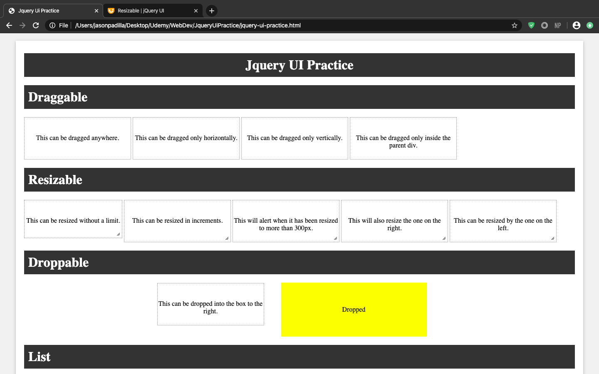
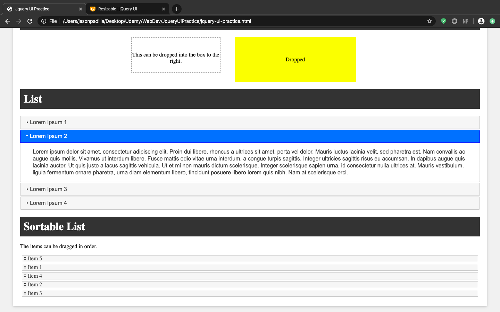

# Jquery UI Practice
 This is a webpage I created to show case the different types of interactions that occur when applying Jquery's user interface. Each box can be interacted with and has a description of what can be done with it. 
 
# What I learned
  * Put into practice my jquery skills
  * Jquery .draggable()
  * Jquery .resizable()
  * Jquery .droppable()
  * Jquery .selectable()
  * Jquery .sortable()
  
# Screenshots

